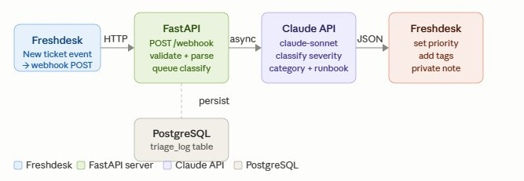
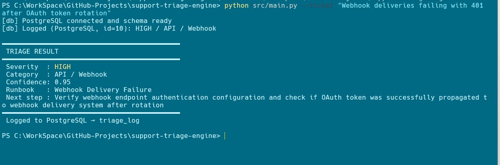
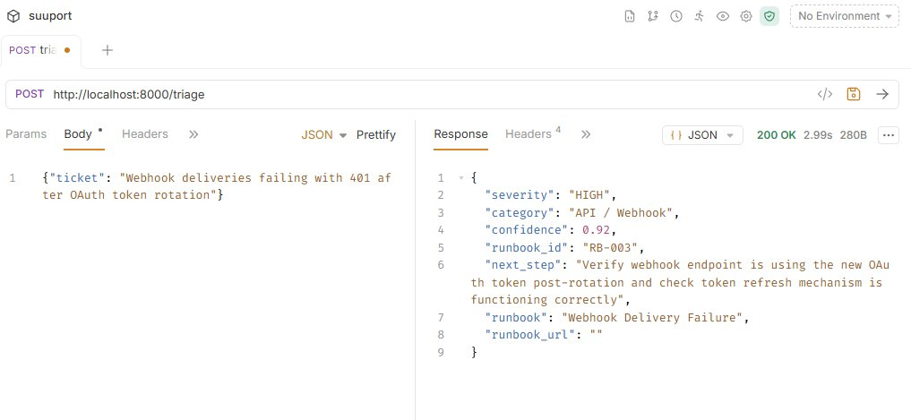
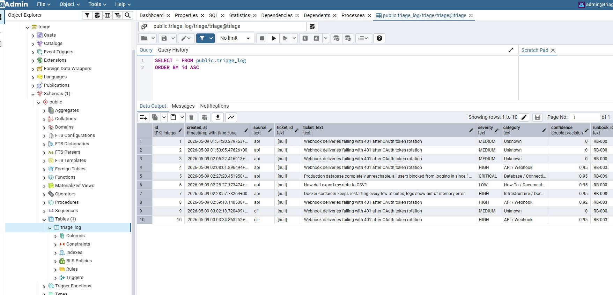
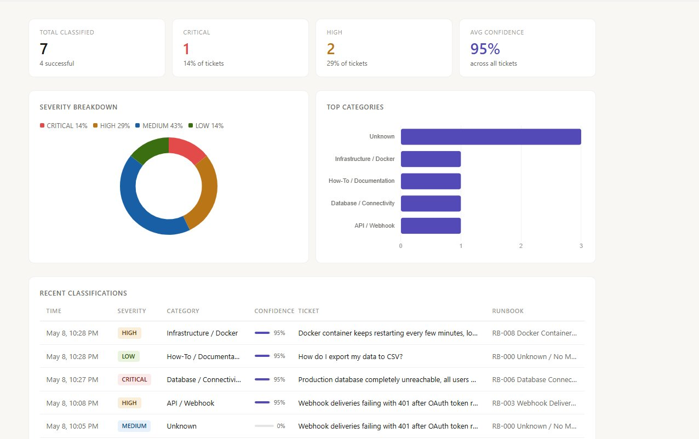
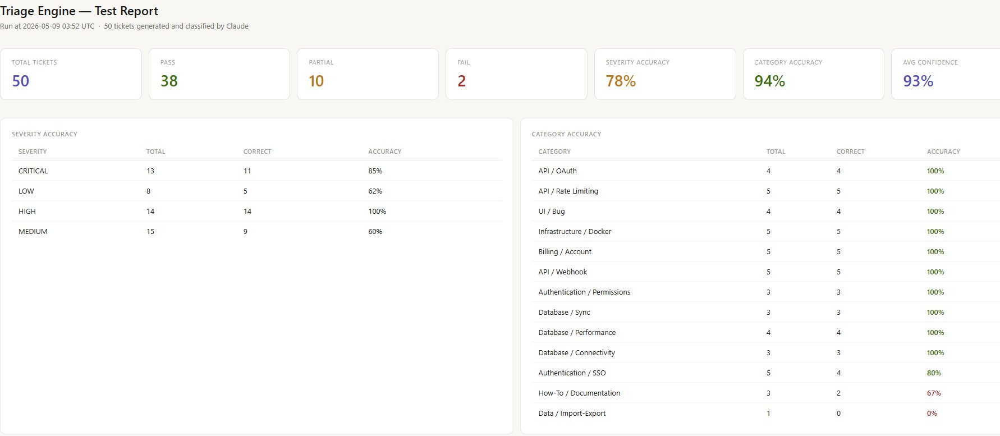
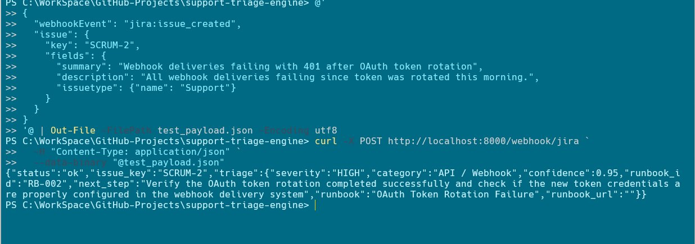
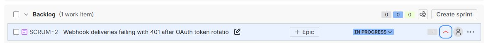
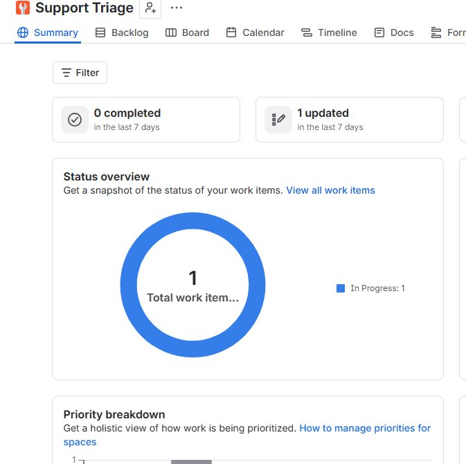

# 🤖 AI-Powered Support Triage Engine

> Classifies incoming support tickets by severity, category, and suggested runbook — using an LLM API backed by PostgreSQL, Docker, and a webhook endpoint compatible with Freshdesk and Jira.


---

## 🎯 Overview

Support teams waste significant time manually routing tickets — reading, categorising, and assigning before any diagnosis begins. This tool automates that first pass: paste or POST a raw ticket, and the engine returns a structured classification (severity, category, suggested runbook) powered by an LLM trained on real support patterns.

Built from 10 years of hands-on pattern recognition across global enterprise SaaS support. The classifications aren't generic — they reflect how API, database, and infrastructure failures actually present in production tickets.

---

## 🏗️ Architecture



A new ticket in Freshdesk triggers a webhook POST to the FastAPI server. The server validates and queues the classification request asynchronously — responding immediately to Freshdesk to avoid timeout — then calls the Claude API to classify severity, category, and runbook. The result is written back to Freshdesk (priority, tags, private note) and persisted to PostgreSQL for audit and pattern analysis.

---

## 📸 Screenshots

### Ticket classification output (CLI)

*CLI output — HIGH severity, API / Webhook, 0.95 confidence, logged to PostgreSQL*

### REST endpoint response (Bruno)

*POST /triage endpoint returning JSON — 200 OK, HIGH severity, 0.92 confidence, RB-003 Webhook Delivery Failure*

### PostgreSQL log — classification history

*Every classification persisted to PostgreSQL — full audit trail with severity, category, confidence, and runbook ID*

### Web UI dashboard

*Live dashboard at `/dashboard` — severity breakdown, top categories, confidence scores, and real-time classification log*

### Automated test report

*Automated test report — 50 Claude-generated tickets classified and scored across all severity levels and categories*

### Jira — AI triage comment

*Triage result posted as a formatted comment in Jira — severity, category, confidence, runbook, and suggested next step*

### Jira — backlog with priority and status

*Issue automatically transitioned to In Progress with priority set to High by the triage engine*

### Jira — project summary

*Project summary reflecting the triage engine's automatic status transition*


---

## 🧰 Tech Stack

- **Language** — Python 3.11
- **API Framework** — FastAPI
- **Database** — PostgreSQL 15
- **Infrastructure** — Docker Compose
- **LLM** — Claude API (claude-sonnet-4-20250514)
- **HTTP client** — httpx
- **DB driver** — asyncpg
- **Testing** — Bruno, pytest, automated LLM-generated test suite

---

## 📁 Project Structure

```
ai-support-triage-engine/
├── docker-compose.yml
├── Dockerfile
├── README.md
├── requirements.txt
├── .env.example
├── src/
│   ├── main.py              # FastAPI app + CLI entrypoint
│   ├── classifier.py        # LLM prompt logic + response parsing
│   ├── db.py                # PostgreSQL connection + triage_log schema
│   ├── config.py            # Env vars, model config
│   ├── freshdesk.py         # Freshdesk REST API client
│   ├── jira_client.py       # Jira Cloud REST API client
│   ├── dashboard.html       # Web UI dashboard
│   └── runbooks.py          # Runbook mapping by category
├── tests/
│   ├── test_classifier.py      # pytest integration tests
│   ├── ticket_generator.py     # Claude-generated realistic test tickets
│   ├── run_tests.py            # automated test runner + HTML report
│   └── scheduler.py            # scheduled test runs (configurable interval)
├── reports/                    # auto-generated HTML test reports
└── docs/
    ├── FRESHDESK_SETUP.md   # Step-by-step Freshdesk webhook guide
    ├── JIRA_SETUP.md        # Step-by-step Jira webhook guide
    └── screenshots/
        ├── architecture-diagram.png
        ├── dashboard.png
        ├── cli-classification-output.png
        ├── bruno-triage-response.png
        ├── postgres-triage-log.png
        ├── test-report.png
        ├── jira-triage-comment.png
        ├── jira-backlog.png
        └── jira-summary.png
```

---

## 🚀 Getting Started

### ✅ Prerequisites

- Docker installed and running
- Python 3.9+
- An Anthropic API key
- A Freshdesk account (API key from Profile Settings)

### ▶️ Step 1 — Clone and configure

```bash
git clone https://github.com/musabe/ai-support-triage-engine
cd ai-support-triage-engine
cp .env.example .env
# Fill in ANTHROPIC_API_KEY, FRESHDESK_DOMAIN, FRESHDESK_API_KEY
```

### ▶️ Step 2 — Start containers

```bash
docker-compose up -d
```

### ▶️ Step 3 — Install dependencies (local dev)

```bash
pip install -r requirements.txt
```

### ▶️ Step 4 — Run via CLI

```bash
python src/main.py --ticket "Webhook deliveries failing with 401 after OAuth token rotation"
```

Expected output:

```
━━━━━━━━━━━━━━━━━━━━━━━━━━━━━━━━━━━━━━━━
 TRIAGE RESULT
━━━━━━━━━━━━━━━━━━━━━━━━━━━━━━━━━━━━━━━━
 Severity  : HIGH
 Category  : API / OAuth
 Confidence: 0.94
 Runbook   : RB-002 — OAuth Token Rotation Failure
 Next step : Verify token expiry window; check webhook signing secret rotation
━━━━━━━━━━━━━━━━━━━━━━━━━━━━━━━━━━━━━━━━
 Logged to PostgreSQL → triage_log
```

### ▶️ Step 5 — Or call the REST endpoint

```bash
curl -X POST http://localhost:8000/triage \
  -H "Content-Type: application/json" \
  -d '{"ticket": "Webhook deliveries failing with 401 after OAuth token rotation"}'
```

---

## 🔌 Freshdesk Integration

See **[docs/FRESHDESK_SETUP.md](docs/FRESHDESK_SETUP.md)** for the full step-by-step guide, including:

- Where to find your Freshdesk API key
- How to create the webhook automation rule
- The exact JSON payload template to paste into Freshdesk
- Using ngrok for local testing

When a ticket is created, the engine automatically:

1. Sets the **priority** — CRITICAL→Urgent, HIGH→High, MEDIUM→Medium, LOW→Low
2. Adds **tags** — `ai-triaged`, `triage:high`, `category:api-oauth`, etc.
3. Posts a **private note** with the full triage summary, confidence score, and suggested next step

---

## 🔗 Jira Integration

See **[docs/JIRA_SETUP.md](docs/JIRA_SETUP.md)** for the full step-by-step guide.

When a Bug or Support issue is created in Jira, the engine automatically:

1. Sets the **priority** — CRITICAL→Highest, HIGH→High, MEDIUM→Medium, LOW→Low
2. Adds **labels** — `ai-triaged`, `triage-high`, `triage-api-webhook`
3. Posts a **formatted comment** with severity, category, confidence, runbook, and next step
4. **Transitions the status** — CRITICAL/HIGH → In Progress, MEDIUM → Waiting for Customer

The webhook endpoint accepts standard Jira Cloud webhook payloads at `POST /webhook/jira`. Only issue types defined in `JIRA_ISSUE_TYPES` are triaged — others are skipped with a reason.

---

## 🧠 How Classification Works

1. Ticket text is sent to Claude with a structured system prompt built from real support patterns
2. The model returns a JSON object: `{ severity, category, confidence, runbook_id, next_step }`
3. Result is validated, mapped to a runbook, and persisted to PostgreSQL
4. Freshdesk is updated via REST API; CLI and REST responses are formatted from the same output

Categories covered: `API / OAuth`, `API / Webhook`, `API / Rate Limiting`, `Database / Sync`, `Database / Performance`, `Database / Connectivity`, `Infrastructure / Docker`, `Infrastructure / Network`, `Infrastructure / Deployment`, `Authentication / SSO`, `Authentication / Permissions`, `Billing / Account`, `Data / Import-Export`, `UI / Bug`, `How-To / Documentation`, `Unknown`

---

## 🧪 Automated Testing

The engine includes a self-testing framework that uses Claude to generate realistic tickets, classifies them, and produces a scored HTML report.

### Test report


**Latest results (50 tickets):**

| Metric | Score |
|---|---|
| Pass | 38 / 50 (76%) |
| Category accuracy | 94% |
| Severity accuracy | 78% |
| Avg confidence | 93% |

**Category highlights:** API / OAuth, API / Webhook, API / Rate Limiting, Infrastructure / Docker, Billing / Account all hit 100% accuracy.

**Severity notes:** HIGH (100%) and CRITICAL (85%) are strong. LOW (62%) and MEDIUM (60%) show the model's tendency to upgrade ambiguous tickets — a known LLM pattern under active tuning.

### Run the tests

```bash
# Run once — 20 tickets (default)
python tests/run_tests.py

# Run with more tickets
python tests/run_tests.py --count 50

# Schedule — run every 6 hours with 10 tickets
python tests/scheduler.py --interval 6 --count 10

# Run scheduler once and exit
python tests/scheduler.py --once
```

Reports are saved to `reports/report_YYYYMMDD_HHMMSS.html` and open directly in any browser.

---

## 🚧 Status

| Feature | Status |
|---|---|
| CLI classifier | ✅ Done |
| FastAPI REST endpoint | ✅ Done |
| PostgreSQL triage log | ✅ Done |
| Docker Compose stack | ✅ Done |
| Runbook mapping (14 runbooks) | ✅ Done |
| Freshdesk webhook integration | ✅ Done |
| Confidence scoring + fallback | ✅ Done |
| Automated test suite + HTML report | ✅ Done |
| Jira webhook integration | ✅ Done |
| Web UI dashboard | ✅ Done |

---

## 👤 Author

**Mustapha Abella**
Senior Technical Support Engineer
Focused on API-driven SaaS, data integration, and developer-facing support

[github.com/musabe](https://github.com/musabe)
